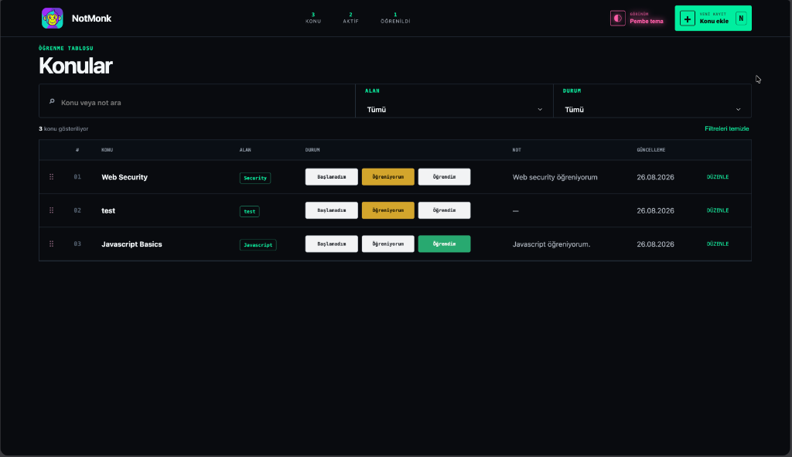
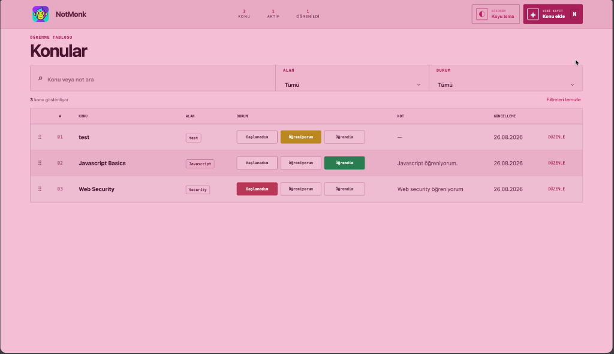

# NotMonk

[Türkçe](#türkçe) | [English](#english)

---

---

## Türkçe

Öğrendiklerinizi, notlarınızı ve ilerlemenizi tek bir yerde takip etmenizi sağlayan Chrome ve Brave tarayıcı eklentisi.

### Kurulum

1. Bu repoyu indirin veya klonlayın.
2. Tarayıcınızda `chrome://extensions` adresini açın.
3. Sağ üstteki **Geliştirici modu** seçeneğini açın.
4. **Paketlenmemiş öge yükle** butonuna tıklayıp bu klasörü seçin.

### Nasıl Açılır?

- **Klavye kısayolu:** `Option + N` (Mac) veya `Alt + N` (Windows)
- **Adres çubuğu:** `nm` yazın -> iki kez `Boşluk` -> `Enter`
- **Eklenti ikonu:** Araç çubuğundaki ikona tıklayın (sağ üstteki buton ile tam sekme yapabilirsiniz)

### Özellikler

- **Konu Ekleme:** `Konu ekle` butonu veya `N` tuşu ile yeni kayıt oluşturun.
- **Durum Takibi:** Tablodan doğrudan `Başlamadım`, `Öğreniyorum`, `Öğrendim` durumunu seçin.
- **Sıralama:** Konuları sol taraftaki tutamaktan sürükleyerek yeniden sıralayın.
- **Alan Yönetimi:** Konuları kategorilere ayırın ve filtreleyin.
- **Temalar:** Sağ üstten Koyu ve Pembe tema arasında geçiş yapın.
- **Gizlilik:** Tüm veriler `chrome.storage.local` üzerinde yerel saklanır, sunucuya veri gitmez.

---

## English

A Chrome and Brave browser extension to track topics you are learning, take notes, and manage progress.

### Installation

1. Download or clone this repository.
2. Open `chrome://extensions` in your browser.
3. Enable **Developer mode** in the top right.
4. Click **Load unpacked** and select this folder.

### How to Open

- **Keyboard shortcut:** `Option + N` (Mac) or `Alt + N` (Windows)
- **Address bar:** Type `nm` -> press `Space` twice -> press `Enter`
- **Toolbar icon:** Click the NotMonk icon in the toolbar (click expand icon for full tab)

### Features

- **Add Topics:** Click `Konu ekle` or press `N` to create a topic.
- **Track Status:** Change status directly in the table: Not Started, Learning, Mastered.
- **Drag to Reorder:** Grab the left handle and drag rows to rearrange.
- **Categories:** Organize topics with custom categories and filters.
- **Themes:** Toggle between Dark and Pink themes in the top navigation.
- **Privacy:** All data is stored locally via `chrome.storage.local`. No external servers.

---

### License

MIT
